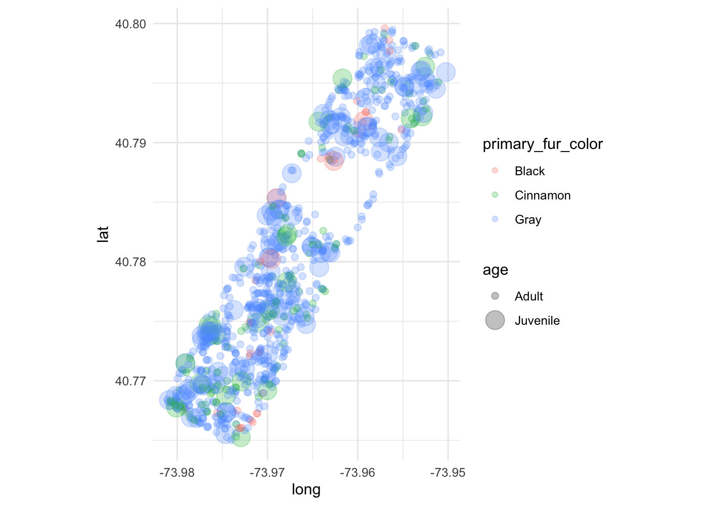

Additional Plot Features Solutions
================
w203: Statistics for Data Science

From here on out, we’re going to start working in **R Markdown Files**.
These files let us weave code and explanation together. What you’re
reading right here is explanation – this isn’t actually run by the
interpreter in the console.

But, what you’re seeing just below – in a “chunk” set off by three
bac-kticks – is a code block.

If you look at line 14, and run this line just as you would have if this
were an .R file (it is a .Rmd file) what happens?

``` r
print('Hello world.')
```

    ## [1] "Hello world."

Now, the result rather than being printed to the console is both printed
in the console and in line with this code. One piece that you might have
noticed is the curly braces after the first set of back-ticks. This is
telling the interpreter that this is code that is written in the R
languge. It is possible (though we won’t do this for now) to write
python, julia, c++ or other code within these chunks and have the
interpreter evaluate them.

Below, I’m going to write a chunk that I’ve called “setup” that is going
to load libraries and set themes and set parameters for plots. I’ve also
added extra arguments to this code chunk declaration – `results =
'hide', warning=FALSE, message=FALSE`. These control how the chunk
works, but let’s not dig **too** far into that just yet.

``` r
library(tidyverse)
library(ggplot2)
theme_set(theme_minimal())
knitr::opts_chunk$set(dpi = 200)
```

In this chunk, which I’ve called “load data” I’m going to load the data,
and then create the date field that we’ve used all along.

``` r
squirrel_subset <- read_csv('./squirrels_subset.csv')
```

    ## Parsed with column specification:
    ## cols(
    ##   long = col_double(),
    ##   lat = col_double(),
    ##   hectare = col_character(),
    ##   date = col_double(),
    ##   age = col_character(),
    ##   primary_fur_color = col_character()
    ## )

``` r
squirrel_subset <- squirrel_subset %>%
  mutate(date_f = as.Date.character(date, format = '%m%d%Y'))
```

Now, you can see below that I’m creating a section in the markdown space
by starting the line with a “hash”. If this were in a code chunk, it
would comment out the line, but here in the markdown space, this will
create a level-1 heading. Two hashes would create a level-2 heading (one
further indent).

# Data Reminder

As a reminder, we’re working with data that is from the “census of
squirrels” in NYC’s central park. Each row is an observation of a
squirrel, and each observation has as much data as possible about the
observation.

## Previous Plots

The last set of plots that we made with `geom_point()` were simple
scatter plots where we passed:

  - The `long`;
  - The `lat`; and,
  - One other feature.

<!-- end list -->

``` r
ggplot(data = squirrel_subset) + 
  aes(x = long, y = lat) + 
  geom_point() + 
  coord_quickmap()
```

<!-- -->

# This plot

For this plot, I’d like you to represent four data series in a single
plot. Because each of these are information in the dataset that we want
to control the way the plot is built, each of the series should go into
the `aes()` funciton.

1.  The `long`;
2.  The `lat`;
3.  The `age`;
4.  The `primary_fur_color`.

I’m sure you’re wondering? What aestetic options are available to me? To
look into this, let’s look into the documentation for `geom_point()`,
because the `geom_point()` inherits its aestetics from the `aes()`
function.

When you run the line below, your Rstudio should then open a help
browser

``` r
# ?geom_point()
```

I see several aesthetics listed:

  - x
  - y
  - alpha, … and many more.

Before you start to build the plot – think about what you might want to
show – you might go as far as to write down the plot that you want to
create (as I’ve just suggested in the lecture) but that isn’t strictly
necessary because this is reasonably straightforward data.

Once you know what you’d like to show, pass data series into these
aesthetics until you have created a plot that you think does a good job
of representing your idea.

> I think that I’d like to show colors of squirrels on the color
> aesthetic, and the age of the squirrels on the size aesthetic. - To
> me, this feels like mapping color to color is sensible. - And, while I
> would have liked the size to be larger for the older squirrels,
> actually it rather makes sense that the older squirrels are the
> smaller points; there seem to me more adults than juveniles and so it
> keeps the plot from becoming too saturated with information. - You
> might also notice that I passed a non-date argument into the
> `geom_point()`. I wanted to be able to see “through” the points so
> that if there were juveniles in one area, I could still see the
> presence of other squirrels in the same area. This is *not* an
> aesthetic that is a data mapping, so it does not go into the `aes()`
> function.

``` r
ggplot(data = squirrel_subset) + 
  aes(x = long, y = lat, color = primary_fur_color, size = age) + 
  geom_point(alpha = 0.25) + 
  coord_quickmap()
```

    ## Warning: Using size for a discrete variable is not advised.

<!-- -->
