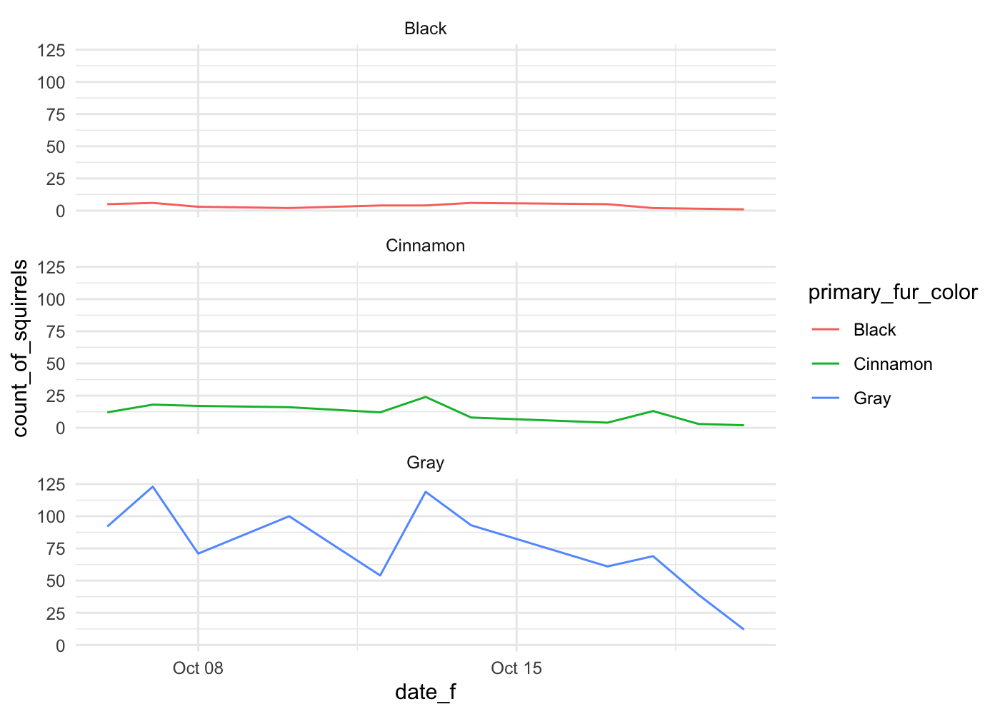

Grouped Data
================
w203: Statistics for Data Science

``` r
library(tidyverse)
library(ggplot2)
# install.packages('patchwork')
library(patchwork)

theme_set(theme_minimal())
knitr::opts_chunk$set(dpi = 200)
```

``` r
squirrel_subset <- read.csv('squirrels_subset.csv')
squirrel_subset <- filter(squirrel_subset, !is.na(primary_fur_color))

squirrel_subset <- squirrel_subset %>%  
  mutate(date_f = as.Date.character(date, format = '%m%d%Y'))
```

# Plots Groups with Colors

A few days ago, we plotted the count of squirrels that were observed
over time.

  - Because it was by time, we reasoned that a line plot did a good job
    of illustrating the connections between the observations
  - The plot looked something like what is below

<!-- end list -->

``` r
squirrel_subset %>%  
  group_by(date_f) %>%  
  summarise(count_of_squirrels = n()) %>%  
  ggplot() + 
  aes(x = date_f, y = count_of_squirrels) + 
  geom_line()
```

    ## `summarise()` ungrouping output (override with `.groups` argument)

<!-- -->
At that point, we asked a challenge question of you, that asked,

> Could you also make this plot and represent the color of the squirrels
> in the plot?

Here, I’ve written the firs set of lines that would do this for you –
this takes the squirrel subset data, groups by date and fur color, and
then counts the number of squirrels that are observed in each of these
combinations.

Complete the plot, by:

  - Adding a `ggplot()` call;
  - Adding an `aes()` call; and,
  - Adding a `geom_line()` call to produce the line

Think, as you’re drawing this plot – what parts of this are mapping from
data that I want to bring into the plot? What do I want to map that
information onto? This might help to keep clear the code that you want
to write.

``` r
squirrel_subset %>%
  group_by(date_f, primary_fur_color) %>%
  summarise(count_of_colors = n()) %>% 
  ggplot() + 
  aes(x = date_f, y = count_of_colors, color = primary_fur_color) + 
  geom_line()
```

    ## `summarise()` regrouping output by 'date_f' (override with `.groups` argument)

<!-- -->

# Plot Groups with Different Graphs

Although I think that it is probably uniformly **less** effective of a
representation in this case, you might instead want to plot each group
on a different axis.

  - To do so, use the `facet_wrap()` function to place each of the
    `primary_fur_colors` onto their own set of axes.
  - To help you along, I’ll note that within `facet_wrap()` you will
    probably have to use the argument `facets =
    vars(primary_fur_color)`. This is a bit of a weird part of the
    `ggplot` api, and something that I hope they’ll fix in the future.
  - However, at least their fair about telling you that you’ll have to
    use the `vars()` function – look into the help documentation for
    this function.

<!-- end list -->

``` r
#?facet_wrap()
```

  - Like before, I’ll start you down the road for this plot by doing the
    data mapping.
  - Which way communicates more clearly for you? Aligning the plots by
    rows? Or aligning them by columns? Why do you think this is?

<!-- end list -->

``` r
squirrel_subset %>%  
  group_by(date_f, primary_fur_color) %>%  
  summarise(count_of_squirrels = n()) %>%  
  ggplot() + 
  aes(x = date_f, y = count_of_squirrels, color = primary_fur_color) + 
  facet_wrap(facets = vars(primary_fur_color), nrow = 3) + 
  geom_line()
```

    ## `summarise()` regrouping output by 'date_f' (override with `.groups` argument)

<!-- -->

> For me, I think that these plots work a **little** bit better when
> they are stacked vertically, because then I can see that all the dates
> align. Of course, immediately upon realizing this, then it becomes
> very clear that this plot would be more successful it were to be
> placed on a single set of axes.
> 
> This kind of iterative plot making is (or at least can be) quite fun;
> and, once you realize that this mapping doesn’t work better, you can
> return to the single set of axes.

``` r
squirrel_subset %>%
  group_by(date_f, primary_fur_color) %>%
  summarise(count_of_colors = n()) %>% 
  ggplot() + 
  aes(x = date_f, y = count_of_colors, color = primary_fur_color) + 
  geom_line()
```

    ## `summarise()` regrouping output by 'date_f' (override with `.groups` argument)

<!-- -->
