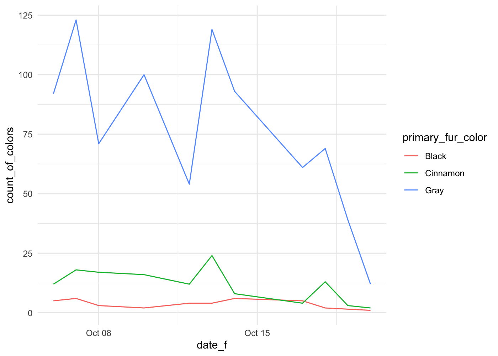

How to Smooth
================
w203: Statistics for Data Science

``` r
library(tidyverse)
library(ggplot2)
# install.packages('patchwork')
library(patchwork)

theme_set(theme_minimal())
knitr::opts_chunk$set(dpi = 200)
```

``` r
squirrel_subset <- read.csv('squirrels_subset.csv')
squirrel_subset <- filter(squirrel_subset, !is.na(primary_fur_color))

squirrel_subset <- squirrel_subset %>%
  mutate(date_f = as.Date.character(date, format = '%m%d%Y'))
```

# Coding Task

There if you plot the grouped plot that we’ve shown a few times now,
there’s a lot of movement in the observations on a daily basis. This
might questions to focus on a particularly productive day on the
squirrel census – “I don’t know why there were more this day\!” – which
isn’t really the point of the plot. Instead, the point of the plot is
that there are many more Gray squirrels but that the number seems to be
decreasing through the census time.

``` r
squirrel_subset %>%
  group_by(date_f, primary_fur_color) %>%
  summarise(count_of_colors = n()) %>% 
  ggplot() + 
  aes(x = date_f, y = count_of_colors, color = primary_fur_color) + 
  geom_line()
```

    ## `summarise()` regrouping output by 'date_f' (override with `.groups` argument)

<!-- -->

## Your Task

Change the plot so that instead the plot uses the `stat_smooth()`
function – to do so, you’ll have to change the `geom_line()` call to
something else.

  - First run the smoother as is
  - Then, suppress the reporting of the standard errors (you will likely
    have to look into the help documentation to figure out what the
    particular argument is that controls those error bars)
  - Then, re-plot again but change the variable that controls the
    “wiggliness” of the lines. Is there a level of this variable that
    you think best communicates the point you want to make with this
    data?

<!-- end list -->

``` r
squirrel_subset %>%
  group_by(date_f, primary_fur_color) %>%
  summarise(count_of_colors = n()) %>% 
  ggplot() + 
  aes(x = date_f, y = count_of_colors, color = primary_fur_color) + 
  stat_smooth(span = .8, se = FALSE)
```

    ## `summarise()` regrouping output by 'date_f' (override with `.groups` argument)

    ## `geom_smooth()` using method = 'loess' and formula 'y ~ x'

<!-- -->
\> I think that this `span = 0.8` is my preferred span. You can see that
it is *just* barely staying smooth – there are a few points where this
plot seems to try to pull away from the general line. Setting the span
higher is over simplifying the trend, to my eye, setting is smaller
recoveres most of the “noise” that we wanted to smooth out of the data.
