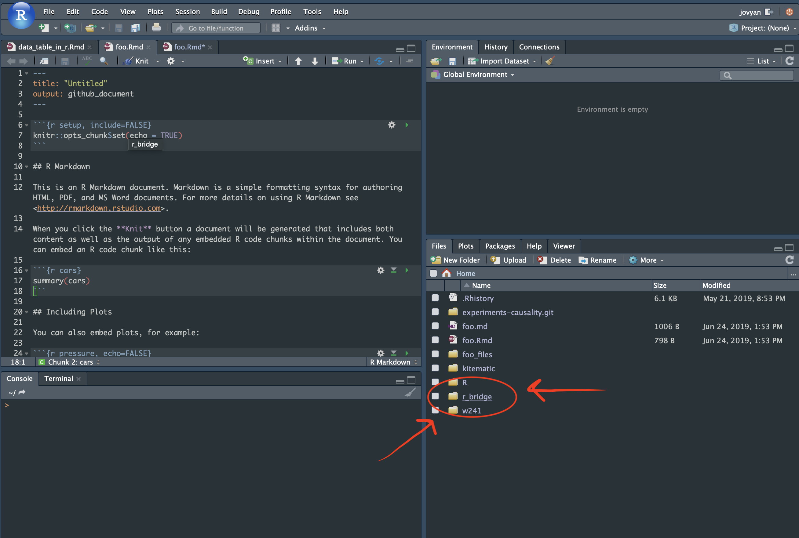

Use the UCB Datahub to do a little bit of practice working with the Rstudio IDE. This is going to be pretty simple work, where you're just goign to execute code that has already been mostly written for you. 

The goal is that you can start to work with the tool, and then when we move forward you can use the tool to answer questions that you're interested in. 

- [UCB Datahub](https://r.datahub.berkeley.edu/hub/user-redirect/git-pull?repo=https%3A%2F%2Fgithub.com%2FUCB-MIDS%2Fr_bridge&urlpath=rstudio%2F&branch=master)

When the datahub starts up, navigate to the `r_bridge` folder, and then `code` and then to the file called, `issuing_code_and_reading_outputs.R`. 

There is kind of a lot of code in there, but you should be able to find it. 
